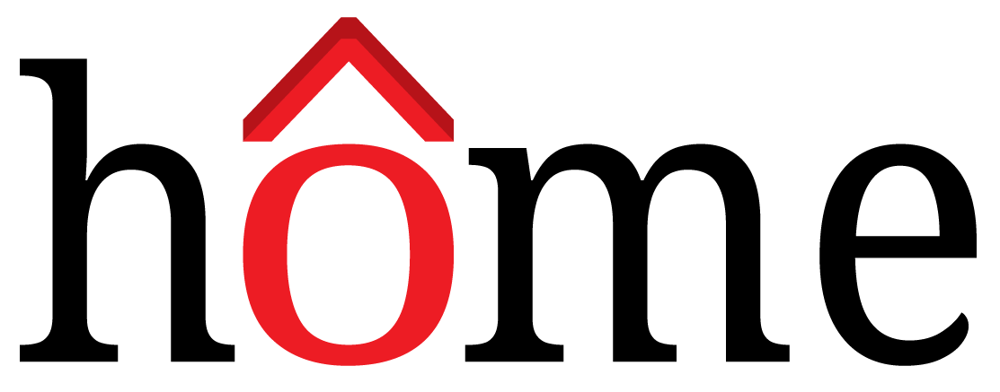
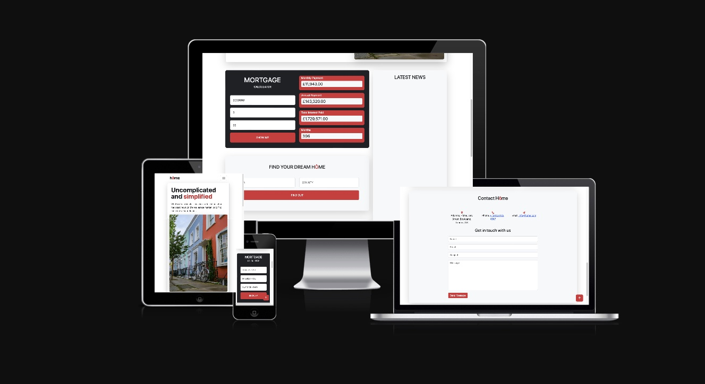

# Home-App 

 
  `Home mortgage helper & live news feed`

## [Table of Contents](#table-of-contents)

* [Description](#description)
* [Acceptance Criteria](#acceptance-criteria)
* [Mock-Up](#mock-up)
* [Installation](#installation)
* [Credits](#credits)
* [License](#license)
* [Badges](#badges)

## [Description](#description)
The Home application uses APIs (Application Programming Interfaces) that pull in the latest rates, snapshot figures on mortgage rates and interest, and relevant housing market news. By working together, these APIs create a more cohesive snapshot of the property and mortgage landscape for everyone involved.

## [Acceptance Criteria](#acceptance-criteria)

### Technical Acceptance Criteria:
* Use Bootstrap.
* Be deployed to GitHub Pages.
* Be interactive (in other words, accept and respond to user input).
* Use at least two server-side APIsLinks to an external site..
* Does not use alerts, confirms, or prompts (use modals).
* Use client-side storage to store persistent data.
* Be responsive.
* Have a polished UI.
* Have a clean repository that meets quality coding standards (file structure, naming conventions, best practices for class/id naming conventions, indentation, quality comments, and so on).
* Have a quality README (including a unique name, description, technologies used, screenshot, and link to the deployed application).

### Presentation Requirements:
* Elevator pitch: a one minute description of your application
* Concept: What is your user story? What was your motivation for development?
* Process: What were the technologies used? How were tasks and roles broken down and assigned? What challenges did you encounter? What were your successes?
* Demo: Show your stuff!
* Directions for Future Development
* Links to the deployed application and the GitHub repository

[Link to presentation](./docs/homeapp_Preso.pptx)

## [Mock-Up](#mock-up)

* [Deployed App](https://abbyedxcmk.github.io/home-app/)

* [Project Repo](https://github.com/abbyedxcmk/home-app)

## [Installation](#installation)

The Home application is engineered to streamline the process of acquiring real 
estate data by harnessing the power of JavaScript and third-party APIs. 
Upon page load, users interact with a form to input mortgage-related information, 
which triggers a seamless API request to a mortgage calculator service. 
This functionality is implemented using asynchronous JavaScript calls, ensuring 
that the most recent mortgage rates and calculations are fetched without 
disrupting the user experience. 
The app leverages HTTP GET requests with appropriate headers to authenticate 
and retrieve data in real-time.
In addition, the application integrates with a property listing API, allowing users to 
search for properties based on specific locations. 
The data fetched includes image URLs, property types, prices, and other relevant 
details, all formatted neatly in British Pounds using the International Number 
Format for consistency and readability.

## [Credits](#credits)

Original code by `Bruno Silva`, `Isiaka Bhadmus`, `Thomas Jack`

 

**Support and mentoring from course mentors:**
 
`Zakariya Hussain`
`Bobbi Tarkany`

**Peer Study Group Support:**
 
`Bruno Silva`
 
`Isiaka Bhadmus`
 
`Thomas Jack`

**Supporting links:**  
API DOCS:
 
https://rapidapi.com/apidojo/api/zoopla
 
https://api-ninjas.com/api
 
https://rapidapi.com/letscrape-6bRBa3QguO5/api/real-time-news-data

## [License](#license)

MIT Licence

Copyright (c) <2023> <Home-App>

Permission is hereby granted, free of charge, to any person obtaining a copy
of this software and associated documentation files (the "Software"), to deal
in the Software without restriction, including without limitation the rights
to use, copy, modify, merge, publish, distribute, sublicense, and/or sell
copies of the Software, and to permit persons to whom the Software is
furnished to do so, subject to the following conditions:

The above copyright notice and this permission notice shall be included in all
copies or substantial portions of the Software.

THE SOFTWARE IS PROVIDED "AS IS", WITHOUT WARRANTY OF ANY KIND, EXPRESS OR IMPLIED, INCLUDING BUT NOT LIMITED TO THE WARRANTIES OF MERCHANTABILITY, FITNESS FOR A PARTICULAR PURPOSE AND NONINFRINGEMENT. IN NO EVENT SHALL THE AUTHORS OR COPYRIGHT HOLDERS BE LIABLE FOR ANY CLAIM, DAMAGES OR OTHER LIABILITY, WHETHER IN AN ACTION OF CONTRACT, TORT OR OTHERWISE, ARISING FROM, OUT OF OR IN CONNECTION WITH THE SOFTWARE OR THE USE OR OTHER DEALINGS IN THE SOFTWARE.

## [Badges](#badges)

## [Features](#features)

N/A

## [Contributing](#contributing)

* Thomas Jack
* Isiaka Bhadmus
* Bruno Silva

## [Tests](#tests)

Tested deployed application. No bugs found
Fully responsive mobile-first design (tested on multiple media types)

 

[Back to top](#top)